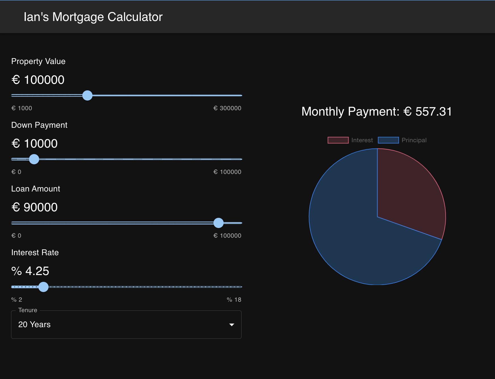

# Mortgage Calculator App

This project is a simple mortgage calculator web application built using React.js. It allows users to calculate their mortgage payments based on the loan amount, interest rate, and loan term.

## Features

- **React Functional Components:** The application is built using React functional components, making it modular and efficient.
- **Material UI:** Material UI is used for creating a visually appealing and responsive user interface.
- **User Inputs:** Users can input the loan amount, interest rate, and loan term to calculate their mortgage payments.
- **Handling Props:** The project demonstrates how to handle props in React, enabling communication between components.
- **Props Destructuring:** It showcases the use of props destructuring to extract values efficiently within components.
- **useState Hook:** The useState hook is utilized to manage stateful logic within functional components, providing dynamic user interactions.

## How to Use

1. Clone the repository to your local machine:
   `git clone https://github.com/Irhutchi/react-mortgage-calculator`

2. Navigate to the project directory:
   `cd react-mortgage-calculator`

3. Install dependencies:
   `npm install`

4. Start the dev server:
   `npm start`

5. Open your browser and visit `http://localhost:3000` to use the mortgage calculator app.

## Credits

This project is inspired by the tutorial created by Joy Shaheb. You can find the original tutorial on YouTube: [Joy Shaheb's Mortgage Calculator Tutorial](https://youtu.be/uluphP4xXD8?si=nzgwzpzjrw5faD2n).

## Screenshot

## Contributing

Contributions are welcome! Feel free to fork the repository, create a branch, and submit a pull request. Please make sure to follow the code of conduct and contribute in a respectful manner.

## License

This project is licensed under the [MIT License](LICENSE.md) - see the [LICENSE.md](LICENSE.md) file for details.
